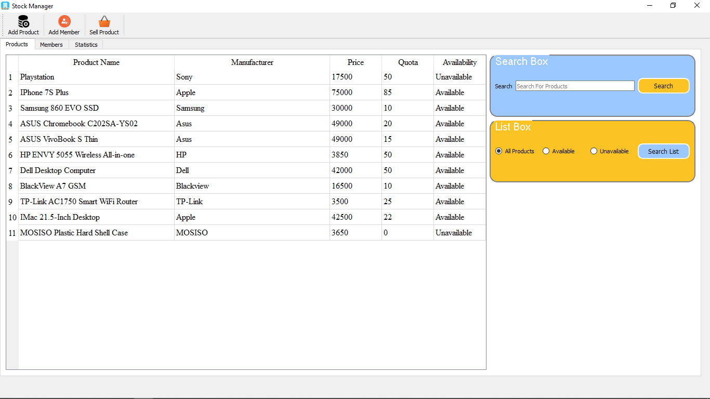

# Stock-Manager
Stock manager app made with PyQt5. This application organize and monitor inventory levels, it keep the count of products and its quantity. It also keep the count of member to whom the product has been sold.
# Requirements
PYQt5

sqlite3
# Screenshots
*Run The main.py File
Product Tab

Member Tab

.png)

Statistic Tab

.png)

you can also use filters to find the product

.png)

click on add product in the toolbar to add product

.png)

click on add member in the toolbar to add member

.png)

you can update products and member

.png)

you can sell the product

.png)

.png)

